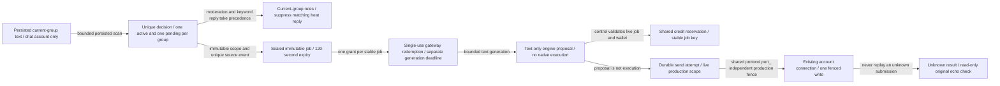

# Heat-Chat architecture

Generated from code evidence; not production acceptance.

```mermaid
%% Generated from source evidence. Do not hand edit.
%% Import / declaration edges are not proof of runtime activation.
flowchart LR
  nb5f72a9d85ae["Current-group rules / suppress matching heat reply"]
  ndda18a0e21ae["Unique decision / one active and one pending per group"]
  ned9f6f250686["Text-only engine proposal / no native execution"]
  n4ea5ee68fea0["Shared credit reservation / stable job key"]
  n3492ad65d05a["Single-use gateway redemption / separate generation deadline"]
  n5e8c9902207a["Sealed immutable job / 120-second expiry"]
  nbef32d2c315a["Existing account connection / one fenced write"]
  ne2c30d592648["Unknown result / read-only original echo check"]
  n27ce1d1bf427["Durable send attempt / live production scope"]
  n41cf6794ba42["Persisted current-group text / chat account only"]
  ndda18a0e21ae -->|"moderation and keyword reply take precedence"| nb5f72a9d85ae
  ndda18a0e21ae -->|"immutable scope and unique source event"| n5e8c9902207a
  ned9f6f250686 -->|"control validates live job and wallet"| n4ea5ee68fea0
  ned9f6f250686 -->|"proposal is not execution"| n27ce1d1bf427
  n3492ad65d05a -->|"bounded text generation"| ned9f6f250686
  n5e8c9902207a -->|"one grant per stable job"| n3492ad65d05a
  nbef32d2c315a -->|"never replay an unknown submission"| ne2c30d592648
  n27ce1d1bf427 -->|"shared protocol port_ independent production fence"| nbef32d2c315a
  n41cf6794ba42 -->|"bounded persisted scan"| ndda18a0e21ae
```
