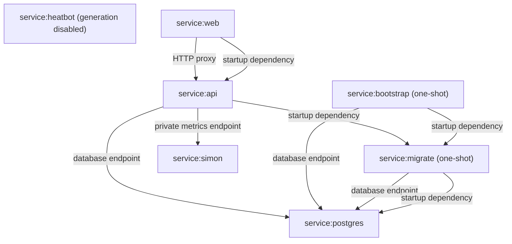

# System architecture

Generated from code evidence; not production acceptance.

```mermaid
%% Generated from source evidence. Do not hand edit.
%% Import / declaration edges are not proof of runtime activation.
flowchart TB
  nfe5f9eb6769e["service:api"]
  naaa9670eea76["service:bootstrap (one-shot)"]
  nc7640b433d9a["service:heatbot (generation disabled)"]
  n3a14a9b688c7["service:migrate (one-shot)"]
  n2235405d4693["service:postgres"]
  n716d8243c64d["service:simon"]
  n8d8bbb52a41a["service:web"]
  nfe5f9eb6769e -->|"startup dependency"| n3a14a9b688c7
  nfe5f9eb6769e -->|"database endpoint"| n2235405d4693
  nfe5f9eb6769e -->|"private metrics endpoint"| n716d8243c64d
  naaa9670eea76 -->|"startup dependency"| n3a14a9b688c7
  naaa9670eea76 -->|"database endpoint"| n2235405d4693
  n3a14a9b688c7 -->|"database endpoint"| n2235405d4693
  n3a14a9b688c7 -->|"startup dependency"| n2235405d4693
  n8d8bbb52a41a -->|"HTTP proxy"| nfe5f9eb6769e
  n8d8bbb52a41a -->|"startup dependency"| nfe5f9eb6769e
```
